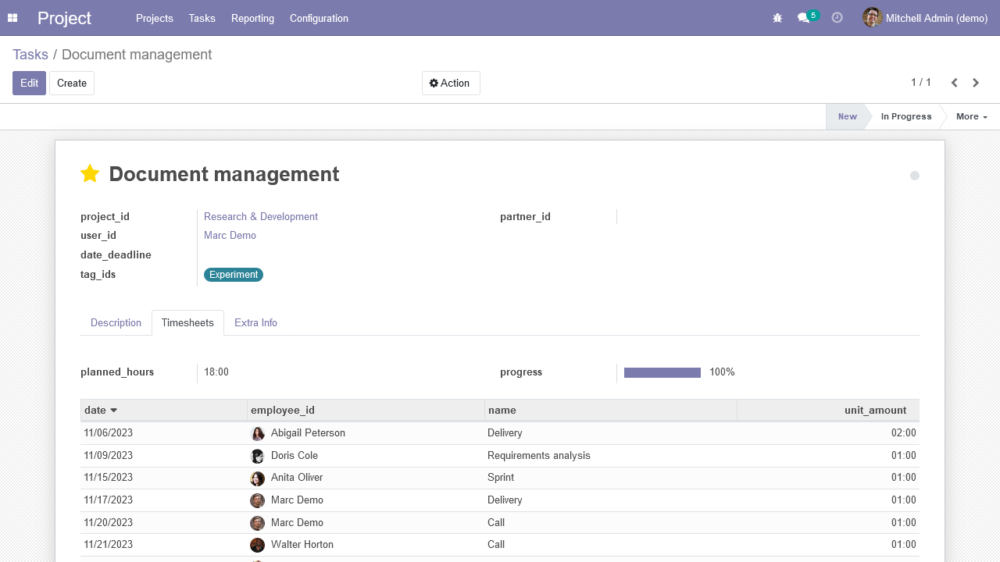

# Debug Fields View
Replace fields label with fields name in views (for development purposes).

This should be more practical than "hovering" over each field with developer
mode (or debug mode) enabled.  Tooltips will still be available for additional
details (such as domain, comodel, ...).

## Configuration
1. add yourself in the "Technical Features" group
2. activate Odoo debug mode

## Known issues / Roadmap
- replicate this feature on form header buttons
- `string` attribute in xml views take priority over this functionality
