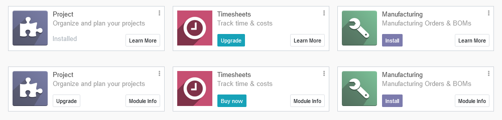

# Kanban Modules Upgrade
Show the upgrade button in kanban when a module is installed.

## Features
- remove "Learn More" button (link to website, still available in form view)
- always show "Module Info" button for easy access to form view
- rename "Upgrade" button (Odoo Enterprise) into "Buy now"
- add "Upgrade" button to actually update already installed modules
