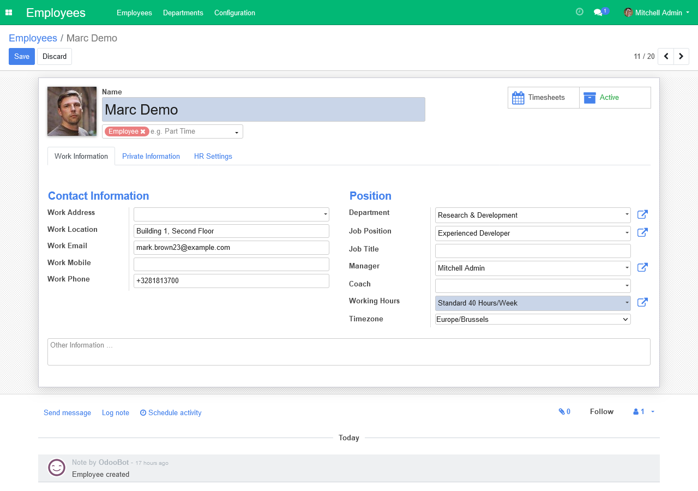

# Odoo Rainbow Theme
Customize the primary color of the Odoo Community theme.

## Features
This module allows you to customize the Community theme's primary color,
also providing separate values for the navbar and buttons.

Colors can be entered in hexadecimal format or chosen from a predefined set
of options.

## Usage
- install Rainbow theme
- go to Settings > General Settings > Rainbow theme
- insert colors or choose a preset

## Known issues / Roadmap
- support for multi-db
- `theme_colors.scss` should be writable by the Odoo user
